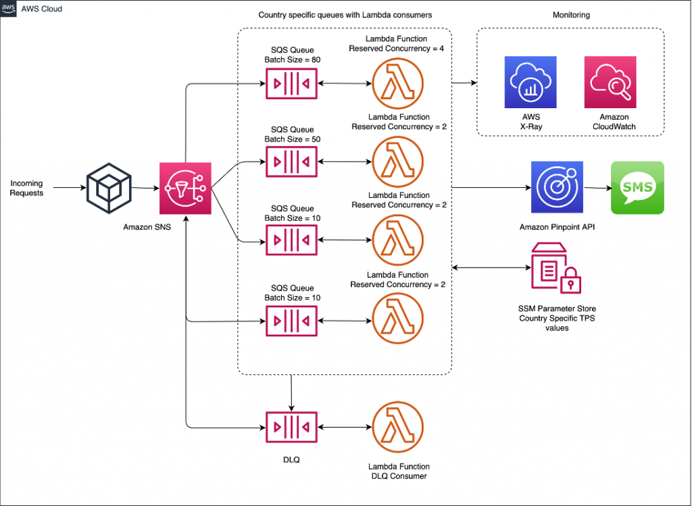

# Scalable Notification Platform

A multi-channel notification system built on AWS serverless services.

## Architecture



## Features

- Event-driven design using SNS + SQS
- Multi-channel notifications (Email, SMS, Push)
- Secure message processing with IAM and encryption
- Scalable serverless infrastructure
- Retry and dead-letter queue for error handling

## Components

1. **API Gateway** - Entry point for sending notifications
2. **SNS Topic** - Fan-out notifications to multiple subscribers
3. **SQS Queue** - Decouple processing from event receipt
4. **Lambda Functions** - Process notifications and route to appropriate channel
5. **Step Functions** - Orchestrate multi-step notification workflows
6. **SES** - Send email notifications
7. **Pinpoint** - Send mobile push notifications
8. **SNS SMS** - Send text messages (optional)

## Deployment

1. Clone this repository
2. Configure AWS credentials
3. Run deployment script:

```bash
./src/scripts/deploy.sh [environment] [region]